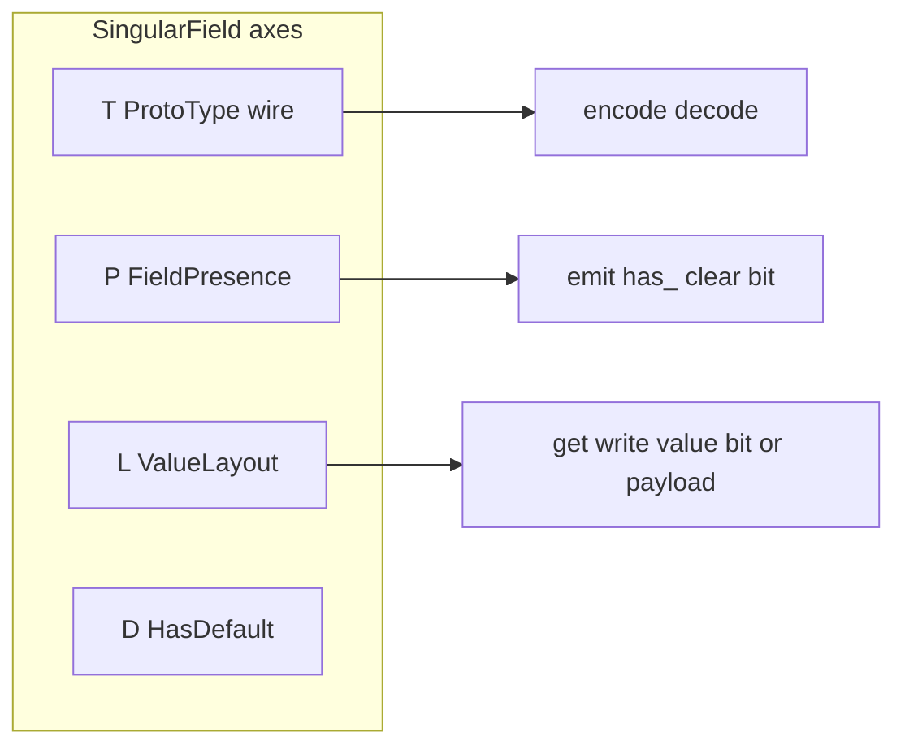

# Plan: Bool value bit via `ValueLayout` (`BitPacked`)

## Goal

Move singular/oneof bool **value** bit index off `ProtoBool` onto a field **value-layout** axis, orthogonal to presence (`P`).

```rust
// Before
SingularField<ProtoBool<A, { BIT_DONE_VALUE }>, Implicit, { FIELD_DONE }>

// After
SingularField<ProtoBool<A>, Implicit, { FIELD_DONE }, BitPacked<{ BIT_DONE_VALUE }>>
```

Presence bits stay on `Explicit` / `LegacyRequired`. Value bits live only on `BitPacked`.

## Locked design



| Axis | Role | Bool |
|---|---|---|
| `T` | Wire / type marker | `ProtoBool<A>` (no bit index) |
| `P` | Presence policy | `Implicit` / `Explicit<PRESENCE>` / `Oneof` |
| `L` | Where the **value** lives | `BitPacked<VALUE_BIT>` |
| `D` | Custom default (unchanged) | usually `ProtoDefault` |

**Type parameter order** (L before D so bool spellings omit `D`):

```rust
SingularField<T, P, const FIELD: u32, L = Inline, D = ProtoDefault>
```

Custom-default fields must pass `Inline` explicitly (2 sites today):

```rust
SingularField<ProtoInt32<A>, Explicit<{ BIT_MAX_RETRIES }>, { FIELD_MAX_RETRIES }, Inline, MaxRetriesDefault>
```

Forgetting `BitPacked` on bool fails to compile: `Inline: ValueLayout<ProtoBool<_>>` is not implemented.

## Trait split

Today [`ProtoType`](puroro-rt/src/fields/wire/proto_type.rs) mixes wire + storage. Storage methods that read `VALUE_BIT` cannot stay on a bit-free `ProtoBool`.

1. **`ProtoType`** — associated types (`Alloc` / `Slot` / `Ref` / `Mut` / `Written`), `WIRE_TYPE`, `encoded_len` / `encode` / `decode` only.
2. **`PayloadAccess: ProtoType`** — `is_proto_empty` / `get` / `with_mut` / `write` / `clear` / `merge` (default = decode + write; `ProtoMessage` keeps recursive merge override). Implemented for all current markers **except** `ProtoBool`.
3. **`ValueLayout<T: ProtoType>`** — storage API used by [`SingularField`](puroro-rt/src/fields/singular/field.rs):
   - `Inline` — `impl<T: PayloadAccess> ValueLayout<T> for Inline` (forward to `PayloadAccess`)
   - `BitPacked<const VALUE_BIT: usize>` — `impl ValueLayout<ProtoBool<A>>` with today’s bit-pack bodies from `ProtoType for ProtoBool`

New module: [`puroro-rt/src/fields/shared/value_layout.rs`](puroro-rt/src/fields/shared/value_layout.rs) (or under `singular/`). Re-export `Inline`, `BitPacked`, `ValueLayout`, `PayloadAccess` from crate root as needed.

## `SingularField` changes

- Add `L: ValueLayout<T>` to struct / Ref / Mut / all impls.
- Replace every `T::is_proto_empty` / `get` / `with_mut` / `write` / `clear` / `merge` call with `L::…`.
- Wire length/encode still use `T::encoded_len` / `T::encode` / `T::get`-via-`L::get` for the value view.
- `PhantomData` includes `L`.

## `ProtoBool` changes

[`varint.rs`](puroro-rt/src/fields/wire/varint.rs):

```rust
pub struct ProtoBool<A: Allocator>(PhantomData<A>);
```

- Implement `ProtoType` (wire only) + `VarintProtoType` / `DefaultIn` / `DeallocateIn` / `AddressableSlot` without `VALUE_BIT`.
- Do **not** implement `PayloadAccess`.
- Docs: singular/oneof require `L = BitPacked<_>`; repeated bool (future) stays plain `bool` elements.

## Sample / call sites

| Site | Change |
|---|---|
| [`task.rs`](sample-generated/src/task.rs) `done` / `flag` | `ProtoBool<A>` + `BitPacked<{ BIT_*_VALUE }>` |
| [`task.rs`](sample-generated/src/task.rs) `max_retries` | insert `Inline` before `MaxRetriesDefault` |
| [`notification.rs`](sample-generated/src/task/notification.rs) `Urgent` | `BitPacked<{ BIT_URGENT_VALUE }>`; update `ProtoType::Ref`/`Mut` aliases to `ProtoBool<A>` |
| [`notification.rs`](sample-generated/src/task/notification.rs) `webhook_id` | insert `Inline` before `WebhookIdDefault` |
| oneof `Urgent` mut projection | still `bit_ref_mut(BIT_URGENT_VALUE)` or via layout — keep working; prefer going through field `value_mut` where already used |

Public accessor shapes (`done()`, `flag_mut()`, …) stay the same.

## Docs

- [`IMPLEMENTATION.md`](IMPLEMENTATION.md): remove “Interim VALUE_BIT on ProtoBool”; document `L` / `BitPacked` / `PayloadAccess`; update struct layout examples.
- [`DESIGN.md`](DESIGN.md): catalog sentence for `SingularField` + bool layout.
- Module docs on `proto_type.rs` / `varint.rs` / `fields.rs`.

## Out of scope

- `repeated bool` implementation
- Changing presence bit assignment algorithm
- Renaming `_common.presence` bitfield (still holds both presence and bool value bits)

## Implementation order

1. Add `ValueLayout` / `Inline` / `BitPacked` + `PayloadAccess`; move storage(+merge) methods from `ProtoType` onto `PayloadAccess` for non-bool markers; slim `ProtoType for ProtoBool` to wire-only + strip `VALUE_BIT`.
2. Thread `L` through `SingularField` / Ref / Mut; switch call sites to `L::`.
3. Update `sample-generated` (bools + two custom-default fields).
4. Sync DESIGN / IMPLEMENTATION.
5. `cargo fmt` + `cargo clippy --all-targets` + `cargo test -p puroro-sample-generated`.

## Success criteria

- `ProtoBool` has no const bit index.
- `done` / `flag` / `urgent` use `BitPacked<{ BIT_*_VALUE }>`.
- Non-bool fields default `L = Inline` (explicit only when `D` is customized).
- All existing sample tests pass; clippy clean on touched crates.
