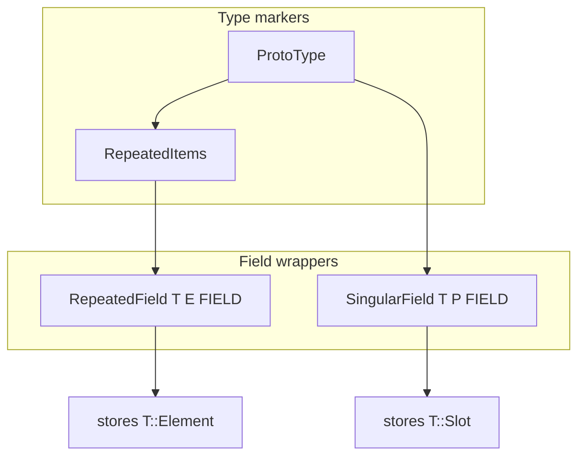

# Plan: Unify repeated fields via `RepeatedElement`

## Goal

Align repeated fields with the singular catalog shape (`T: ProtoType` + one field wrapper), without forcing repeated message storage through `UnmanagedBox` (double indirection).

## Design decisions (locked)

1. **Element type is not `T::Slot`.** Add an associated type for what the repeated vec stores.
2. **Future repeated message:** `Element = M` (inline in the vec buffer). Singular keeps `Slot = UnmanagedBox<M, A>`.
3. **Future repeated bool:** plain `bool` elements; bit-packed `ProtoBool<VALUE_BIT>` does **not** participate.
4. **This change does not implement** repeated message / repeated bool — only lays the type path so they fit later.
5. **Public mut API stays as today** for this pass: varint `*_mut()` → `Vec` guard; LEN `push_*` only. DESIGN §4.4 `push_tag_id` cleanup is out of scope.

## Target shape

```rust
// One catalog wrapper (replaces RepeatedVarintField + RepeatedLenField)
RepeatedField<T, E, const FIELD: u32>
where
    T: RepeatedItems,           // : ProtoType
    E: RepeatedEncoding<T>,     // Packed | Expanded (see below)
// stores: ManuallyDrop<UnmanagedVec<T::Element, T::Alloc>>
```

Generated `Task` members become:

```rust
tag_ids: RepeatedField<ProtoInt32<A>, Packed, { FIELD_TAG_IDS }>,
scores:  RepeatedField<ProtoInt32<A>, Expanded, { FIELD_SCORES }>,
labels:  RepeatedField<ProtoString<A>, Expanded, { FIELD_LABELS }>,
```

Allocator type param `A` on the field drops; use `T::Alloc` like `SingularField`.



## Trait layout

### New: `RepeatedItems` (name in code; docs may say “RepeatedElement”)

In [`puroro-rt/src/fields/wire/`](puroro-rt/src/fields/wire/) (likely next to `proto_type.rs` or a small `repeated_items.rs`):

```rust
pub trait RepeatedItems: ProtoType {
    /// Physical element in the repeated buffer (not necessarily `Slot`).
    type Element: DefaultIn<Alloc = Self::Alloc> + DeallocateIn<Alloc = Self::Alloc>;

    /// Whether packed encode is meaningful (varint numerics / enums: true; string/bytes/message: false).
    const PACKABLE: bool;

    fn get_element<'a>(elem: &'a Self::Element) -> Self::Ref<'a>;

    fn encoded_len_element(elem: &Self::Element, field: u32) -> usize;
    fn encode_element<B: BufMut>(elem: &Self::Element, field: u32, buf: &mut B);

    /// Decode **one** expanded (non-packed) occurrence after the tag.
    fn decode_element<B: Buf>(
        wire_type: WireType,
        buf: &mut B,
        alloc: Self::Alloc,
    ) -> Result<Self::Element, DecodeError>;

    /// Append from a packed LEN payload (only used when `PACKABLE`; default: reject).
    fn merge_packed_into<B: Buf>(
        values: &mut impl ExtendOrPush<Self::Element>, // concrete: VecGuard
        buf: &mut B,
        alloc: Self::Alloc,
    ) -> Result<(), DecodeError>;
}
```

Exact helper signatures can match existing `merge` bodies; the point is: **all element wire/lifecycle lives on the marker**, not on two field wrappers.

### Element mapping (initial impls)

| Marker | `Element` | `PACKABLE` |
|---|---|---|
| `ProtoInt32` / other addressable varints / `ProtoEnum` | `T::Value` (`i32`, …) | `true` |
| `ProtoString` / `ProtoBytes` | `UnmanagedString` / `UnmanagedVec<u8>` (today’s `LenProtoType::Storage`) | `false` |
| `ProtoMessage<M, A>` | *(later)* `M` | `false` |
| `ProtoBool<VALUE_BIT>` | **no impl** | — |

### Encoding policy

Generalize [`repeated/encoding.rs`](puroro-rt/src/fields/repeated/encoding.rs):

- **`Expanded`:** for each element, `T::encode_element` (covers expanded varint, string, bytes, future message).
- **`Packed`:** only for `T::PACKABLE == true`; encode one LEN blob via existing packed-varint helpers (still driven by marker wire fns).

`RepeatedEncoding<T>` bound (or equivalent) so `RepeatedField<ProtoString, Packed, _>` does not compile.

Decode (unchanged policy): packable fields accept both packed LEN and expanded; non-packable accept only per-element LEN (today’s LEN merge).

### Demote wire-family traits

[`VarintProtoType`](puroro-rt/src/fields/wire/varint.rs) / [`LenProtoType`](puroro-rt/src/fields/wire/len.rs) remain as **internal helpers** for marker impls (`encode_wire`, `Storage`, …), but **repeated field wrappers no longer bound on them**. Docs in `proto_type.rs` / `fields.rs` / IMPLEMENTATION §5–7 / §15 update accordingly.

## Runtime file changes

| Action | Path |
|---|---|
| Add | `puroro-rt/src/fields/wire/repeated_items.rs` (or fold into `proto_type.rs` if small) |
| Replace | `repeated/varint.rs` + `repeated/len.rs` → `repeated/field.rs` (`RepeatedField` / `Ref` / `Mut`) |
| Update | `repeated/encoding.rs` — generic over `RepeatedItems` |
| Update | `repeated.rs`, `lib.rs` re-exports; keep temporary type aliases (`RepeatedPackedVarintField`, …) forwarding to `RepeatedField<…>` for one migration step if useful, then delete |
| Update | `sample-generated/src/task.rs` + tests if signatures change |
| Update | `DESIGN.md` (catalog mention) + `IMPLEMENTATION.md` §2–8, §15 |

### `RepeatedFieldMut` behaviour (preserve)

| | Packable (`Element: Copy`) | Non-packable (string/bytes) |
|---|---|---|
| Read | `as_slice() -> &[Element]` | same |
| Mut | `values_mut() -> VecGuard` | `push_in(...)` (no full `_mut`) |
| Clear | clear buffer | drain + per-element `deallocate_in` |
| Merge | packed and/or expanded via `RepeatedItems` | one element append |

Split mut methods with trait bounds / separate inherent impls so string fields do not expose a useless `Vec<UnmanagedString>` mut API.

## Out of scope (explicit)

- Implementing `RepeatedItems for ProtoMessage` / shipping repeated message accessors
- `repeated bool` marker
- Changing DESIGN §4.4 vs § Mutation API (`push_*` vs `*_mut`) beyond what sample already does
- Fixed32/64 repeated
- protoc plugin

## Implementation order

1. Add `RepeatedItems` + impls for current varint + LEN markers (delegate to existing `VarintProtoType` / `LenProtoType` helpers).
2. Implement `RepeatedField` + generalized `Packed` / `Expanded`.
3. Port encode/merge/deallocate/bind paths from the two old wrappers; delete old wrappers.
4. Update `sample-generated` + re-exports.
5. `cargo fmt` + `cargo clippy --all-targets` on touched crates; run `sample-generated` tests.
6. Doc sync (`IMPLEMENTATION.md` primary; short DESIGN note on catalog type).

## Success criteria

- One repeated catalog type parametrised by `T: RepeatedItems` + `E`.
- No `RepeatedVarintField` / `RepeatedLenField` as distinct storage types.
- `Task` still encodes/decodes; public accessor shapes for `tag_ids` / `scores` / `labels` unchanged for callers.
- Docs state: singular stores `Slot`, repeated stores `Element`; future message repeated uses `Element = M`.
